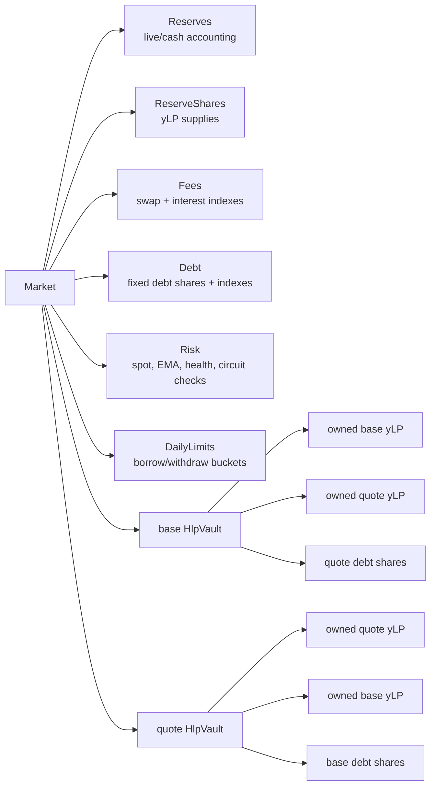
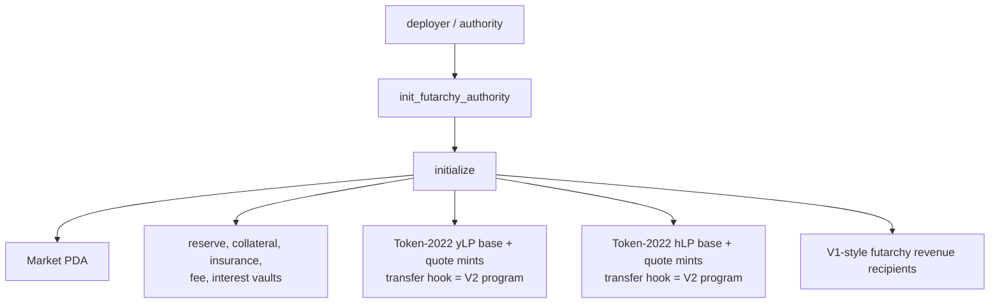
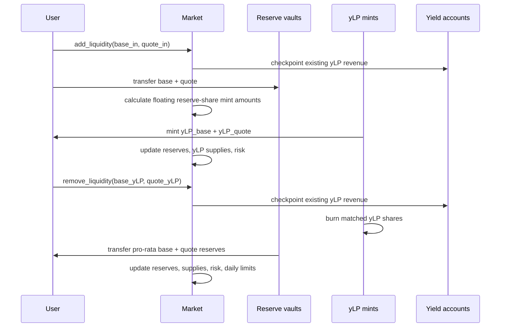
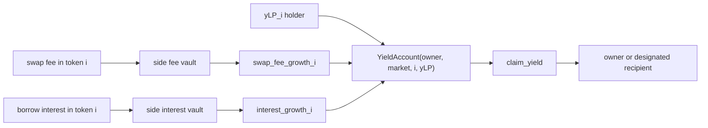
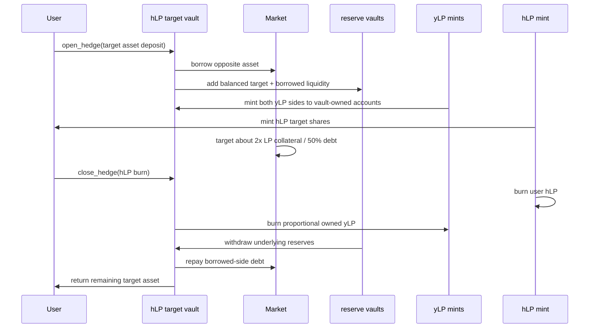
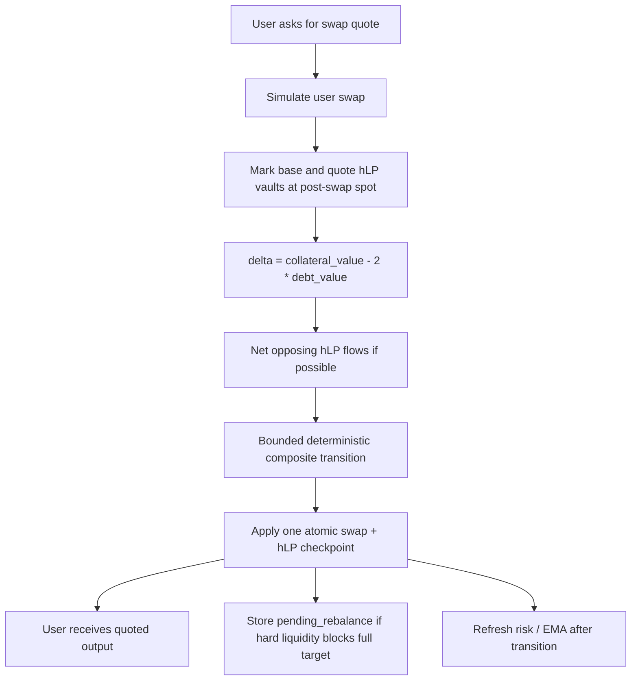
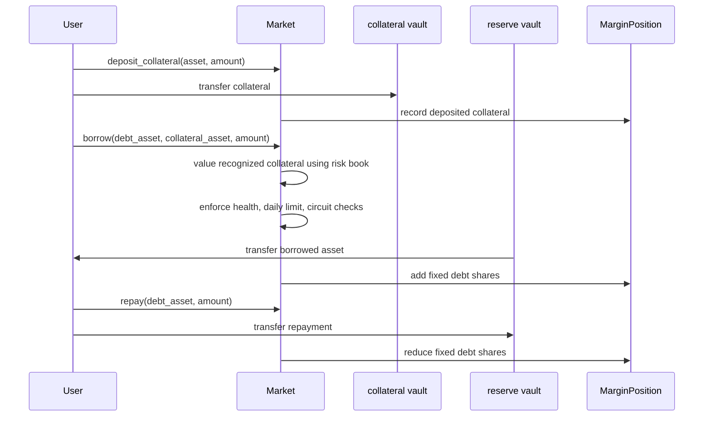
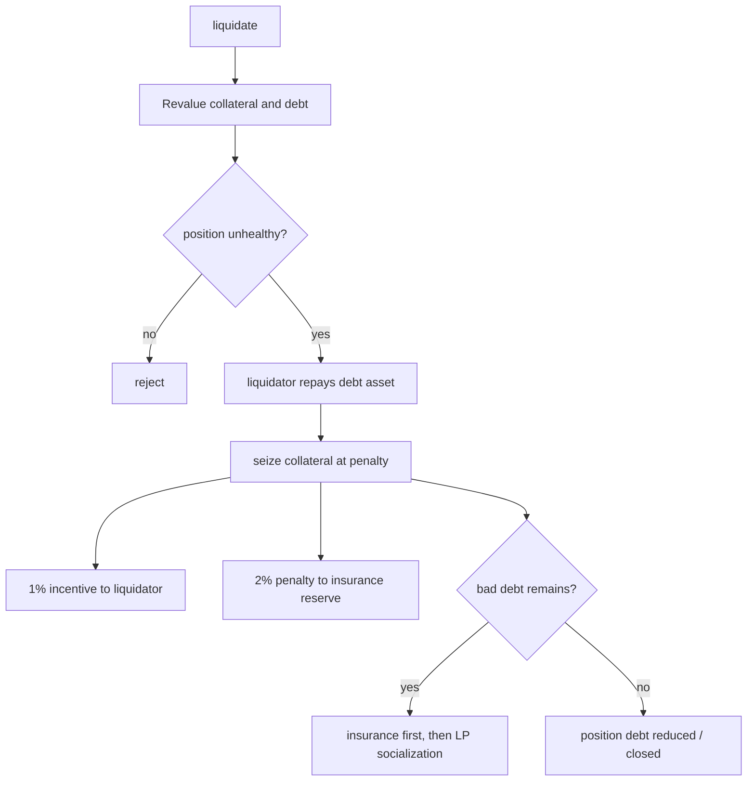
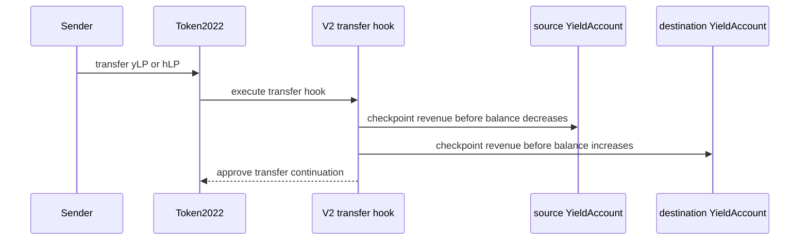

# Omnipair V2 yLP / hLP User Flow Charts

Brief implementation map for the final V2 model.

## Core State

## Market Initialization

## Normal LP: Add / Remove Liquidity

Key point: yLP is a floating reserve-side share. There is no fixed 1:1 claim and no buffer token.

## yLP Revenue

Revenue is non-compounding. It is claimable separately and does not rebase principal reserves.

## hLP Open / Close

hLP is a vault share over aggregate 2x LP leverage. Debt is denominated in the borrowed underlying asset, never in yLP.

## Swap With O(1) hLP Rebalancing

The user quote includes the hLP reaction. There is no hidden post-swap rebalance.

## Borrow / Repay

Idle collateral does not pump market health. Borrowing uses recognized collateral and fixed underlying-token debt.

## Liquidation

Solvent liquidation penalty is split 1% liquidator and 2% insurance reserve.

## Transfer Hooks

Transfers require the canonical yield accounts so fee indexes cannot be bypassed.
